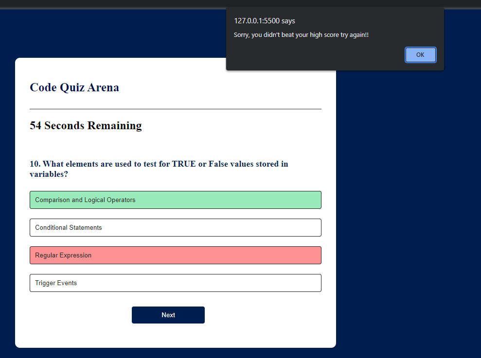

# Code Quiz Arena

## Description

This is the code quiz arena, it is a simple game designed to test your knowledge about javascript.

- I created this project to provide a metric for your basic understanding of javascript
- the game provides you with a high score that it tracks so you can keep track of your best scores
- a timer is also used to add a sense of urgency to the questions
## Table of Contents (Optional)

If your README is long, add a table of contents to make it easy for users to find what they need.

- [ScreenShots](#ScreenShots)
- [link](#Link)
- [License](#license)

## ScreenShots

Here is the main screen, you click the start button and it will recall your highscore and begin the quiz.
 .

Once the start button is pushed the questions will populate and choices will render, only one choice is allowed.
 .

after choosing an answer it will either turn green or red depending on if its correct or not.
if an incorrect answer is chosen the correct answer will be revealed.

 .

when either the time runs out or all the questions have been answered you will get a prompt letting you know if you beat your high score or not.

## Link
link to the deployed app
https://jgarnaat.github.io/Code-Quiz-Arena/
